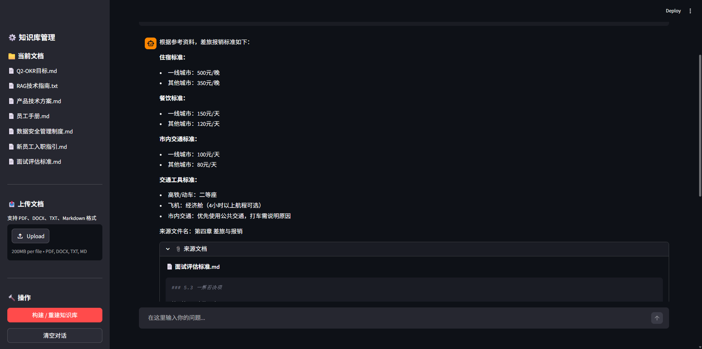

# 🏢 Enterprise RAG Knowledge Base Q&A System

> A production-ready RAG (Retrieval-Augmented Generation) knowledge base system that enables employees to get accurate answers from enterprise documents using semantic search and AI-powered response generation.




## 📖 What is RAG?

**RAG (Retrieval-Augmented Generation)** is a technique that combines information retrieval with large language models (LLMs). Instead of relying solely on the LLM's training data, RAG first searches a knowledge base for relevant documents, then feeds those documents as context to the LLM to generate accurate, grounded answers.

**Traditional approach vs RAG:**

| | Traditional LLM | RAG System |
|---|---|---|
| Knowledge | Limited to training data | Continuously updated from your documents |
| Accuracy | May hallucinate | Grounded in real documents |
| Privacy | Data sent to model provider | Local vector store, sensitive data stays in-house |
| Cost | Expensive fine-tuning | Just upload new documents |

## 🎯 Use Cases

### Enterprise Scenarios
- **Internal Knowledge Base** — New employees can ask questions about company policies, onboarding guides, and technical documentation instead of digging through scattered files
- **Technical Documentation Assistant** — Developers query API docs, architecture guides, and troubleshooting manuals to get instant, accurate answers
- **Compliance & HR Q&A** — Employees get instant answers about data security policies, interview standards, and company procedures
- **OKR & Goal Tracking** — Quickly query quarterly objectives and team goals without searching through multiple documents

### Personal Scenarios
- **Study Notes Q&A** — Upload lecture notes and textbooks, then ask questions to review and test understanding
- **Research Paper Analysis** — Upload academic papers and ask the AI to explain concepts, compare methodologies, or summarize findings
- **Personal Knowledge Management** — Build a searchable knowledge base from bookmarks, clippings, and personal notes

## ✨ Features

### Core Capabilities
- 📄 **Multi-format Document Support** — Upload PDF, Word (.docx), TXT, Markdown, and HTML files
- 🔍 **Semantic Search** — Uses sentence embedding models to find conceptually relevant content (not just keyword matching)
- 🤖 **AI-Powered Answers** — DeepSeek generates context-aware responses with source citations
- 📊 **Knowledge Base Management** — View loaded documents, rebuild the vector store, and manage your knowledge base
- 💬 **Conversational Interface** — Chat-style Q&A with conversation history
- 🎨 **Polished UI** — Clean, responsive web interface built with Streamlit

### Technical Highlights
- **Vector Store**: ChromaDB for efficient similarity search
- **Embedding Model**: `all-MiniLM-L6-v2` via sentence-transformers (lightweight, fast, good for Chinese + English)
- **Document Processing**: Recursive character text splitting with configurable chunk size and overlap
- **LLM Integration**: DeepSeek API via LangChain's OpenAI-compatible interface

## 🏗️ Architecture

```
┌─────────────────────────────────────────────────────────────┐
│                     Streamlit Web UI                        │
│  ┌──────────────┐  ┌──────────────┐  ┌──────────────────┐  │
│  │  Upload Docs │  │  Ask Question │  │  Manage KB       │  │
│  └──────┬───────┘  └──────┬───────┘  └────────┬─────────┘  │
└─────────┼─────────────────┼───────────────────┼─────────────┘
          │                 │                   │
┌─────────▼─────────────────▼───────────────────▼─────────────┐
│                      RAG Engine                              │
│  ┌──────────────┐  ┌──────────────┐  ┌──────────────────┐  │
│  │ Load & Split │  │ Vector Store │  │  RAG Chain       │  │
│  │ Documents    │  │ (ChromaDB)   │  │  (LangChain)     │  │
│  └──────────────┘  └──────────────┘  └──────────────────┘  │
└─────────────────────────────────────────────────────────────┘
          │                                       │
          ▼                                       ▼
┌──────────────────┐                  ┌──────────────────────┐
│ Document Files   │                  │ DeepSeek API         │
│ (PDF/DOCX/TXT/MD)│                  │ (LLM for generation) │
└──────────────────┘                  └──────────────────────┘
```

### Data Flow

```
1. Document Upload
   PDF/DOCX/TXT → Text Extraction → Chunk Splitting → Embedding → ChromaDB

2. Question Answering
   User Question → Embedding → Similarity Search (top-k chunks)
   → [Question + Retrieved Context] → DeepSeek LLM → Answer with Sources
```

## 📁 Project Structure

```
rag-knowledge-base/
├── app.py                  # Streamlit web interface
├── rag_engine.py           # RAG engine: document processing, vector store, chain
├── requirements.txt        # Python dependencies
├── .env.example            # Environment variables template
├── docs/                   # Sample knowledge base documents
│   ├── Q2-OKR目标.md
│   ├── RAG技术指南.txt
│   ├── 产品技术方案.md
│   ├── 员工手册.md
│   ├── 数据安全管理制度.md
│   ├── 新员工入职指引.md
│   └── 面试评估标准.md
├── vectorstore/            # ChromaDB persistent storage (auto-generated)
└── screenshots/            # UI screenshots
```

## 🚀 Quick Start

### Prerequisites
- Python 3.9+
- DeepSeek API Key ([Get one here](https://platform.deepseek.com))

### Installation

```bash
# 1. Clone the repository
git clone https://github.com/SsllF8/enterprise-rag-qa.git
cd enterprise-rag-qa

# 2. Create virtual environment
python -m venv .venv
.venv\Scripts\activate      # Windows
# source .venv/bin/activate  # Linux/Mac

# 3. Install dependencies
pip install -r requirements.txt

# 4. Configure environment
cp .env.example .env
# Edit .env and fill in your DEEPSEEK_API_KEY

# 5. Run the application
streamlit run app.py
```

Or simply double-click `启动应用.bat` on Windows.

### First Run

On first launch, the system will automatically:
1. Load all documents from the `docs/` directory
2. Split them into chunks
3. Generate embeddings using the sentence-transformers model
4. Build and persist the ChromaDB vector store

> ⚠️ The first run downloads the embedding model (~90MB), which may take a few minutes.

## ⚙️ Configuration

Create a `.env` file based on `.env.example`:

| Variable | Required | Description |
|----------|----------|-------------|
| `DEEPSEEK_API_KEY` | ✅ | Your DeepSeek API key |
| `DEEPSEEK_BASE_URL` | ❌ | API base URL (defaults to `https://api.deepseek.com`) |

## 🛠️ Tech Stack

| Component | Technology | Purpose |
|-----------|-----------|---------|
| Web Framework | Streamlit | Interactive web UI |
| LLM Framework | LangChain | RAG chain orchestration |
| LLM | DeepSeek | Response generation |
| Vector Database | ChromaDB | Embedding storage & similarity search |
| Embedding Model | sentence-transformers (`all-MiniLM-L6-v2`) | Text vectorization |
| Document Parsing | pypdf, python-docx, BeautifulSoup | Multi-format text extraction |
| Text Splitting | LangChain TextSplitters | Chunk-based document processing |

## 🔧 How It Works

### Document Processing Pipeline

1. **Load** — Read documents from `docs/` directory (supports PDF, DOCX, TXT, MD, HTML)
2. **Split** — Recursive character text splitting (chunk_size=500, overlap=50)
3. **Embed** — Convert each chunk to a vector using `all-MiniLM-L6-v2`
4. **Store** — Save vectors and metadata to ChromaDB for fast retrieval

### Query Pipeline

1. **Embed Query** — Convert the user's question to a vector
2. **Search** — Find the top-k most similar document chunks in ChromaDB
3. **Augment** — Combine the question with retrieved context
4. **Generate** — Send to DeepSeek to produce a grounded, accurate answer

## 📝 Sample Questions to Try

With the included sample documents (`docs/`), you can ask:

- "新员工入职需要准备什么材料？"
- "公司的数据安全管理制度有哪些要求？"
- "Q2 的 OKR 目标是什么？"
- "RAG 技术的核心原理是什么？"
- "面试评估标准中对候选人有哪些要求？"

## 🤝 Contributing

Contributions are welcome! Please feel free to submit a Pull Request.

## 📄 License

This project is licensed under the MIT License.
